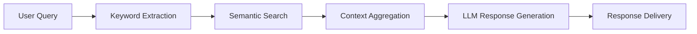

# INSAT AI Student Assistant 🤖🎓


## 📌 Project Overview

An intelligent chatbot designed specifically for INSAT students, providing instant access to academic information through natural language queries. The system combines:

- **Ollama/Llama3** for French-Arabic-English understanding
- **Pinecone vector search** for precise document retrieval
- **Markdown document processing** for structured knowledge extraction

## 🏗️ System Architecture



## 🧩 Core Components

### 1. Document Processing Pipeline
- **Text Extraction**: Specialized Markdown parser for INSAT documents
- **Chunking**: 360-character segments with 100-char overlap
- **Metadata Enrichment**: Automatic heading hierarchy detection

### 2. Vector Knowledge Base
- **Embeddings**: Nomic-embed-text (768-dimension)
- **Indexing**: Pinecone serverless (AWS us-east-1)
- **Query Optimization**: Hybrid keyword/semantic search

### 3. Response Generation
- **Two-stage prompting**:
  1. Keyword distillation
  2. Context-aware answering
- **Safety Filters**: Academic integrity protections

## 🛠️ Installation Guide

### Prerequisites
- Python 3.9+
- Ollama installed and running
- Pinecone account

### Step-by-Step Setup

1. **Environment Preparation**
```bash
git clone https://github.com/your-repo/insat-ai-assistant.git
cd insat-ai-assistant
python -m venv .venv
source .venv/bin/activate  # Linux/Mac
.venv\Scripts\activate    # Windows
```

2. **Install Dependencies**
```bash
pip install -r requirements.txt
```

3. **Configuration**
Create `.env` file:
```ini
PINECONE_KEY=your_pinecone_key
PINECONE_HOST=https://botinsat-5b8ecvg.svc.aped-4627-b74a.pinecone.io
```


## 🚀 Deployment Options

### Option A: Local Development
```bash
streamlit run app.py --server.port 8501
```

### Option B: Docker Deployment
```bash
docker build -t insat-chatbot .
docker run -p 8501:8501 -e PINECONE_KEY=$PINECONE_KEY insat-chatbot
```

## 📚 Data Preparation

### Document Format Requirements
```markdown
# Department Name  <!-- Level 1 Heading -->

## Service Name  <!-- Level 2 Heading -->

### Specific Topic  <!-- Level 3 Heading -->

Content paragraphs...
```

(place in ./INSAT.formatted.md)

## 🌍 Multilingual Support

The system automatically detects and processes:
- French (primary)
- English
  

## 📧 Contact

**Project Lead**: Roua Mili  
**Email**: roua.mili@insat.ucar.tn  


Would you like me to add any specific operational procedures or troubleshooting sections?
